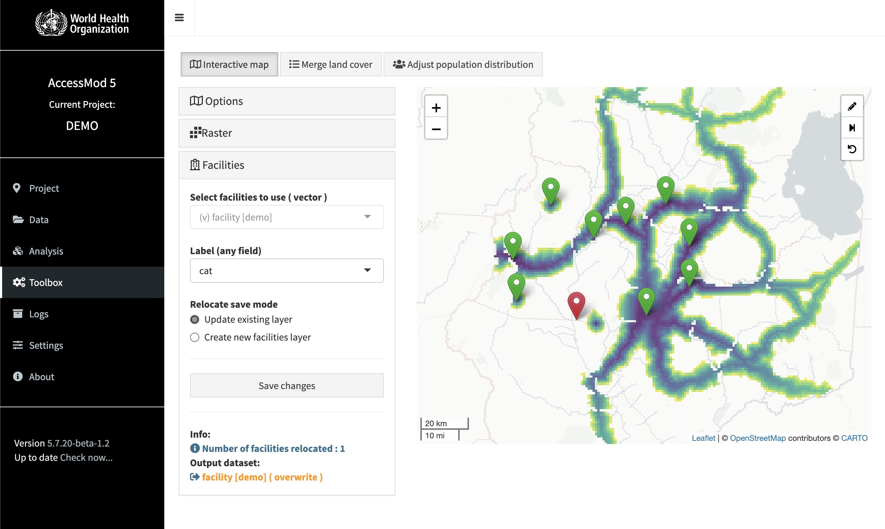

 _AccessMod 5_

## Summary

This is the main repository of `AccessMod 5`.

`AccessMod 5` is a tool to analyze geographical accessibility to or from given locations, using anisotropic movements and multimodal transport processes (e.g. walk, bicycles, motorized vehicles). This package may help to analyze catchments of peoples who can reach a central point in a given time and transport model or determine where new public services should be scaled up in priority.

This product is developed by the GeoHealth group at the unviersity of Geneva, in collaboration with the World Health Organization and MORU/Health GeoLab Group (Manila, Philippines).

<figure>

</a>
<figcaption>
</em>AccessMod user interface, interactive map. Visualization of generated travel time layer and a set of facilities.</em>
<hr>
</figcaption>
</figure>


## User manual

Download the latest version of the user manual in the Download section of the Accessmod website : [accessmod.org](https://www.accessmod.org/).

Or Access the online version of the user manual : [accessmod online user manual](https://doc-accessmod.unepgrid.ch/display/EN/AccessMod+5+user+manual)


## Development

```sh
# Launch AccessMod stack 
# with app files bind mounted -> /app in docker-compose.yml 
$ docker compose up

# Check if the app server is working:  http://localhost:3080/status
# Check if the agent server is working:  http://localhost:5080/status

# --------- app dev session 
$ docker compose exec R
> source('run.r')

# --------- app dev non-interactive session  
$ docker compose exec am5_dev Rscript --vanilla run.r
# Debbuging http.r in a secondary session :
# 1) Comment the source(http.r) line in run.r 
# 2) docker compose exec am5_dev R 
# 3) source('http.r')


# ---------- Replay analysis (dev)

# Launch a development session for the app
$ docker compose exec am5_dev R
> source('global.R')
> amAnalysisReplayExec("<path to config>.json")


# ---------- BUILD IMAGES
# Build base images
cd docker
./build.sh


# ---------- BASIC END-TO-END TESTS 
# Default script 
$ ./tests.sh
# - or - direct command with docker compose 
$ docker compose exec am5_dev Rscript tests/start.R 
# - or - from an interactive session 
$ docker compose exec am5_dev R
> source('tests/start.R') 

```


## Electron

```sh
cd electron
yarn start 
# yarn start:debug for an interactive session, with external debugger.
```

- State is stored in application data 
- Browser, communication with electron : 
   - amcom.getState('data_location').then(console.log);
   - amcom.request('list_versions',{}).then(console.log);
   - amcom.getState('port_host').then(console.log);
   - ...

## Issues

The bugs and new functionality request should be reported here :
[`AccessMod 5` issues](https://github.com/fxi/accessModShiny/issues)
