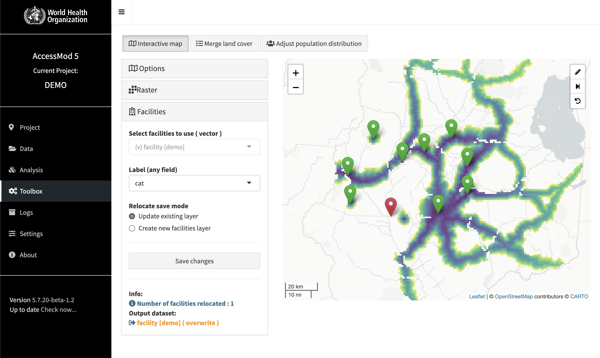

 _AccessMod 5_

[](https://github.com/unige-geohealth/accessmod/actions/workflows/accessmod_pipeline.yml)
## Summary

This is the main repository of `AccessMod 5`.

`AccessMod 5` is a tool to analyze geographical accessibility to or from given locations, using anisotropic movements and multimodal transport processes (e.g. walk, bicycles, motorized vehicles). This package may help to analyze catchments of peoples who can reach a central point in a given time and transport model or determine where new public services should be scaled up in priority.

This product is developed by the [GeoHealth group](https://unige.ch/geohealth) at the University of Geneva, in collaboration with the World Health Organization and [MORU/Health GeoLab Group](https://www.tropmedres.ac/units/moru-bangkok/epidemiology/our-team-1/health-geolab) (Manila, Philippines).

<figure>

</a>
<figcaption>
</em>AccessMod user interface, interactive map. Visualization of generated travel time layer and a set of facilities.</em>
<hr>
</figcaption>
</figure>


## User manual

Download the latest version of the user manual in the Download section of the Accessmod website : [accessmod.org](https://www.accessmod.org/).

Or Access the online version of the user manual : [accessmod online user manual](https://doc-accessmod.unepgrid.ch/display/EN/AccessMod+5+user+manual)


## Development

```sh
# Launch AccessMod stack
# App files are bind-mounted from the repo root -> /app (see docker-compose.yml)
$ docker compose up

# Two ports are exposed:
#   localhost:3080  -> container:3000  direct R/Shiny session (dev, see below)
#   localhost:3180  -> container:3100  shiny-manager session (main managed process)
#
# Check that the managed session is running:
#   http://localhost:3180
# Healthcheck endpoint (used by docker-compose):
#   http://localhost:3180/health


# --------- dev session (hot-reload workflow)
# Starts a Shiny app directly on port 3000 -> localhost:3080
# Bypasses shiny-manager; reload with source('run.r') as needed.
$ npm run dev
# OR interactively:
$ docker compose exec am5_dev R
> source('run.r')


# ---------- Replay analysis (dev)
$ docker compose exec am5_dev R
> source('global.R')
> amAnalysisReplayExec("<path to config>.json")
# example:
> amAnalysisReplayExec("/data/dbgrass/demo/demo/accessmodConfigs/lAnalysisParameters__425.json")


# ---------- BUILD IMAGES
cd docker
./build.sh

# ---------- Github actions testing (not fully implemented)
act --secret-file .secrets --remote-name github --container-architecture linux/amd64


# ---------- TESTS  (see tests/README.md for structure and patterns)
# Default script
$ npm run test
# - or - direct command with docker compose
$ docker compose exec am5_dev Rscript tests/start.R
# - or - from an interactive session
$ docker compose exec am5_dev R
> source('tests/start.R')

```

### Versionning 

When something is ready to be tested or published, update the version with this utility

```sh 
# create a new version
# from staging (image only) / main branch (full)
$ npm run version 
```


## Branches
- `main`: Contains the production-ready code..
- `staging`: Used for integrating new features and minor versions.

### Expected Workflow

1. **Integrate a feature in a dedicated branch.**
2. **Test the feature.**
3. **Merge into the `staging` branch.**

## Electron

```sh
cd electron
yarn start 
# yarn start:debug for an interactive session, with external debugger.
```
## Issues

The bugs and new functionality request should be reported here :
[`AccessMod 5` issues](https://github.com/fxi/accessModShiny/issues)
