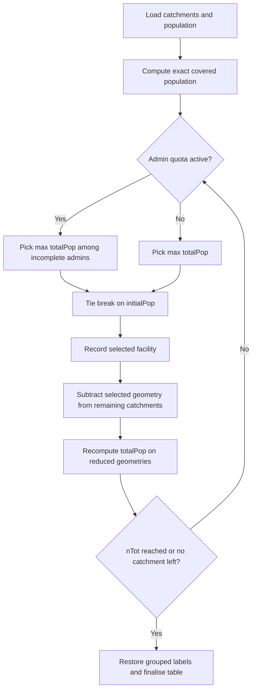

# Optimization

Port from `inAccessMod`:
<https://github.com/unige-geohealth/inAccessMod/blob/main/R/hf_best_cov.R>

## Purpose

`amAnalysisOptimization()` selects the facilities that maximise cumulative
population coverage from a set of catchment polygons and one population raster.

It is a greedy algorithm:

1. Measure covered population for each catchment.
2. Select the current best catchment.
3. Remove its covered geometry from the remaining catchments.
4. Recompute covered population on the reduced geometries.
5. Repeat until `nTot` is reached or no residual coverage remains.

## Inputs

Expected inputs are already validated by AccessMod import or generated by
upstream AccessMod tools.

Core objects used by the algorithm:

```text
catchments  : polygons, one row per facility catchment
population  : raster used for exact polygon sums
facilities  : points, only needed for admin assignment
admin       : polygons, only needed for admin quotas
```

## Duplicate Catchments

Some facilities may share exactly the same catchment geometry.

The algorithm handles that in two steps:

1. Detect duplicate geometries with `st_equals()`.
2. Keep only one row per geometry for the greedy loop.
3. Restore grouped labels at the end, for example:

```text
Facility A // Facility B
```

This keeps the optimisation stable while preserving traceability in the result.

## Greedy Loop



## Admin Quotas

When `adminCheck = TRUE`, the algorithm first tries to satisfy the minimum
selection count `npAdmin` in each admin unit.

Once all admin quotas are satisfied, selection returns to plain greedy ranking.

## Fully Contained Catchments

If a remaining catchment is fully contained in a selected one, its residual
geometry becomes empty after `st_difference()`.

Those rows are moved aside during the main loop and may be appended back at the
end if needed to preserve the expected standalone behaviour when `nTot` is
larger than the number of unique residual catchments with positive coverage.

## Output

```text
adminCheck = FALSE
  amRank
  amFacilityName
  amPopCovered
  amPopCoveredCumul

adminCheck = TRUE
  amRank
  amFacilityName
  amPopCovered
  amAdminRegion
  amAdminId
  amPopCoveredCumul
```
